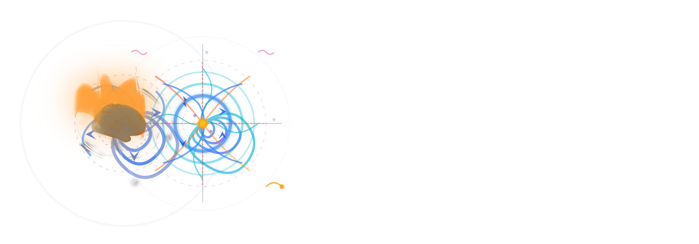

Phenomenological whole-brain modelling using Stuart-Landau oscillators at Hopf bifurcation, susceptible to noise, delays and perturbations.

`optimize_GEC` optimises generative effective connectivity using stochastic gradient descent.

# Citation
If you use this code in your research, kindly cite: 
- Deco et al. (2017) *The dynamics of resting fluctuations in the brain: metastability and its dynamical cortical core*.
- Sanz Perl et al. (2022) *Strength-dependent perturbation of whole-brain model working in different regimes reveals the role of fluctuations in brain dynamics*.
- Cabral et al. (2022) *Metastable oscillatory modes emerge from synchronization in the brain spacetime connectome*.
- Kringelbach et al. (2023) *Toward naturalistic neuroscience: Mechanisms underlying the flattening of brain hierarchy in movie-watching compared to rest and task*.
- Luppi et al. (2025) *Competitive interactions shape brain dynamics and computation across species*.

## License
> This software is distributed under the modified 3-clause BSD Licence.

\(C\) George Blackburne, Hanna Tolle - 2025.
